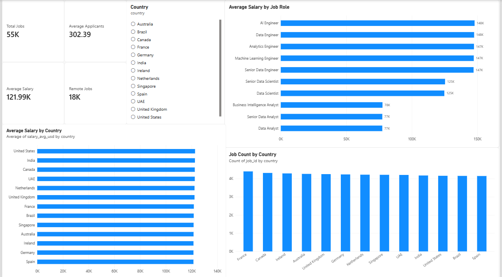
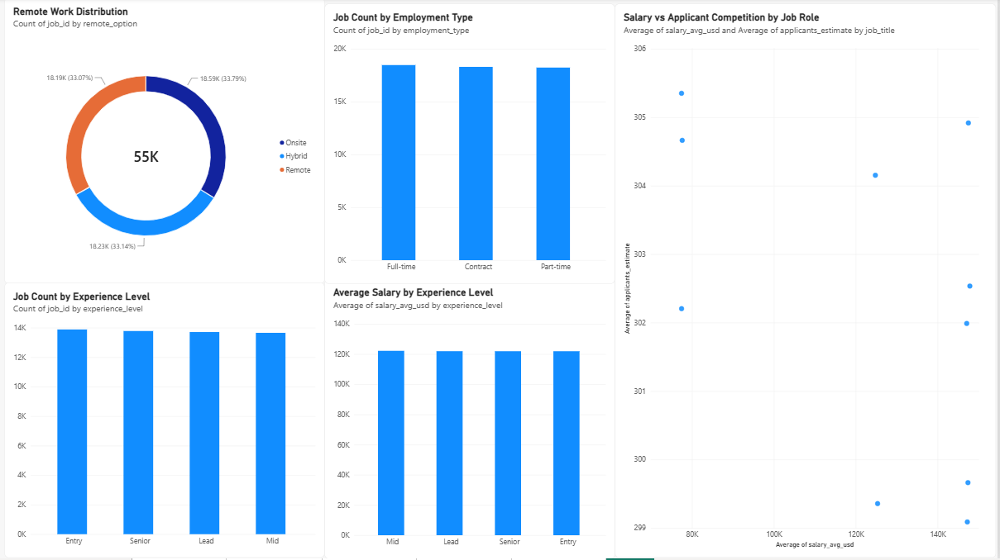
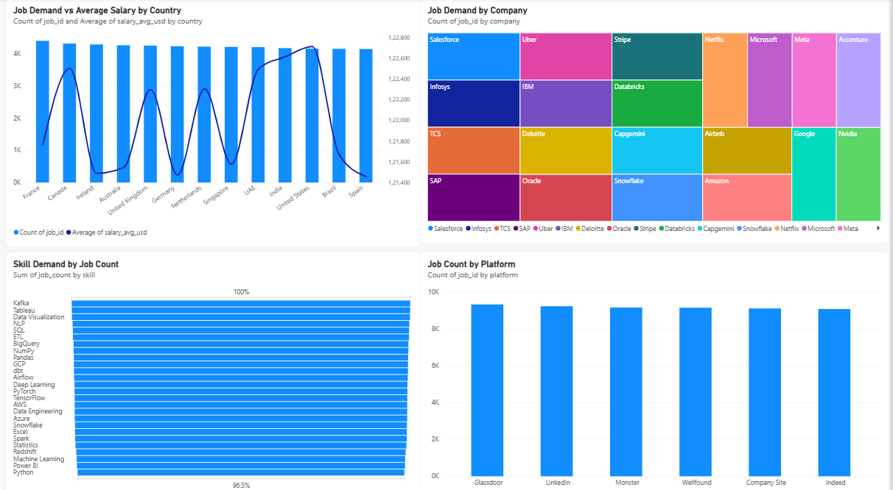
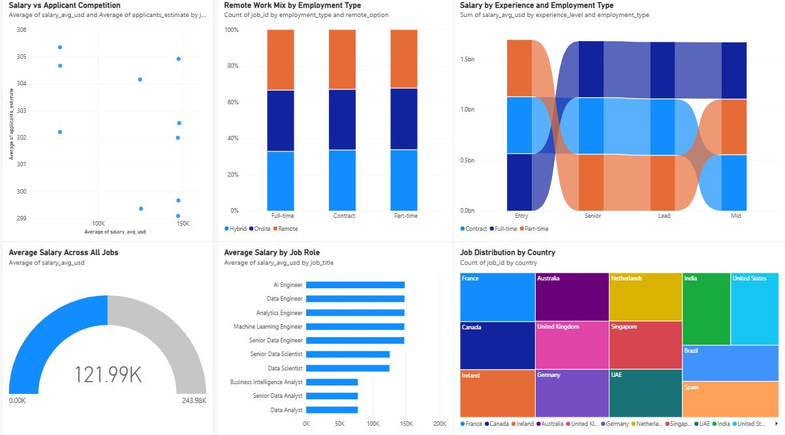
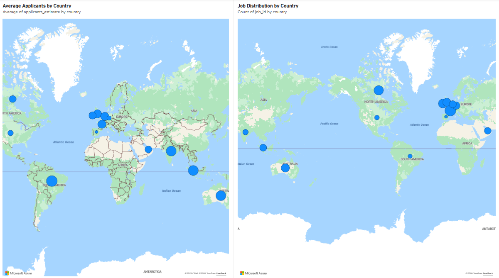

# Job Market Intelligence & Skills Gap Analyzer

An end-to-end data analytics project analyzing job demand, salaries, skills, locations, employment types, remote work, and applicant competition using Python, SQL, SQLite, and Power BI.

## Project Overview

This project transforms raw job-posting data into an analytical dataset and interactive Power BI dashboards.

The analysis covers:

- Job demand across countries, companies, platforms, and roles
- Salary analysis by role, country, experience level, and employment type
- Remote, hybrid, and onsite work distribution
- Applicant competition
- In-demand technical skills
- Data cleaning and quality validation
- SQL-based analytical summaries
- Interactive Power BI dashboards

## Technology Stack

- **Python** — Data ingestion, cleaning, transformation, and analysis
- **Pandas** — Data processing and preparation
- **SQL** — Analytical queries
- **SQLite** — Local analytical database
- **Power BI** — Interactive dashboards and data visualization
- **Git & GitHub** — Version control and project portfolio

## Dataset

The project analyzes approximately **55,000 job postings** across multiple countries, companies, platforms, experience levels, employment types, and remote-work categories.

The project also incorporates job-skill relationships to analyze demand for technical skills.

## Data Pipeline

```text
Raw Job Data
     ↓
Data Profiling
     ↓
Data Cleaning & Validation
     ↓
Feature Engineering
     ↓
Analytical Dataset
     ↓
SQLite Database
     ↓
SQL Analysis
     ↓
Power BI Dashboard

## Power BI Dashboard

### Executive Overview



### Experience, Employment & Applicant Competition



### Job Demand, Companies, Skills & Platforms



### Salary, Remote Work & Employment Analysis



### Geographic Job Distribution



## Key Analytical Areas

### Job Market Demand

Analysis of job volume across:

- Countries
- Companies
- Job roles
- Recruitment platforms

### Salary Analysis

Analysis of average salary and salary ranges across:

- Job roles
- Countries
- Experience levels
- Employment types

### Skills Intelligence

Identification of technical skills appearing across job postings, including:

- SQL
- Tableau
- Data Visualization
- ETL
- Python
- Pandas
- NumPy
- Kafka
- BigQuery
- AWS
- GCP
- Azure
- Machine Learning
- Deep Learning

### Workforce & Competition Analysis

The dashboard analyzes:

- Remote / hybrid / onsite work
- Employment types
- Experience levels
- Applicant estimates
- Salary versus applicant competition

## Project Structure

```text
job-market-intelligence/
│
├── src/
│   ├── ingestion/
│   ├── processing/
│   ├── storage/
│   └── analysis/
│
├── screenshots/
│   ├── dashboard_page_1.png
│   ├── dashboard_page_2.png
│   ├── dashboard_page_3.png
│   ├── dashboard_page_4.png
│   └── dashboard_page_5.png
│
├── Job_Market_Intelligence_Dashboard.pbix
├── requirements.txt
├── .gitignore
└── README.md

🚧 **Project Completed**

The complete data pipeline, analytical database, SQL analysis, and Power BI dashboard have been developed.

## Author

**Vamsi Krishna Movva**

Data Analyst | Business Analyst | Power BI | SQL | Python
